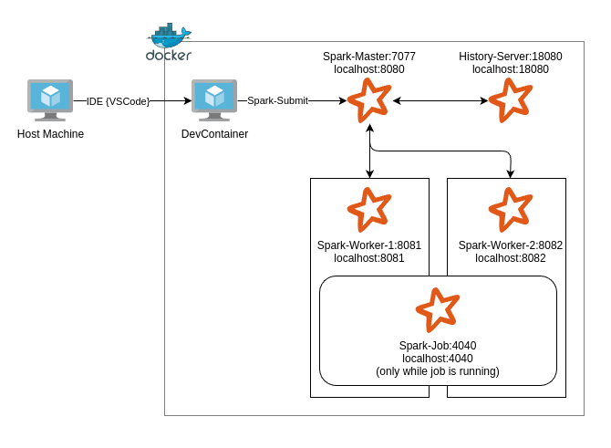

# Apache Spark Cluster DevContainer - Complete Distributed Computing Environment

A complete Apache Spark cluster development environment using VS Code DevContainers. This setup provides a fully configured multi-node Spark cluster with master, workers, history server, and comprehensive monitoring capabilities running in Docker containers with zero-configuration setup.

## 🚀 Why Use This DevContainer?

### Zero-Configuration Distributed Spark Environment
This DevContainer provides a fully configured and isolated Spark cluster environment inside containers, ensuring consistent, reproducible, and platform-independent setup across your entire team. No more complex Spark installation procedures or "_works on my machine_" cluster configuration issues.

### Complete Multi-Node Spark Cluster
This DevContainer includes a full Spark ecosystem with enterprise-grade capabilities:

- **🏗️ Spark Master**: Cluster coordination and resource management
- **⚡ Multiple Workers**: Configurable worker nodes with custom CPU/memory allocation
- **📊 History Server**: Persistent job history and metrics across cluster restarts
- **🔍 Web UIs**: Comprehensive monitoring dashboards for cluster, jobs, and applications
- **📝 Event Logging**: Persistent storage for Spark events and application logs
- **🐍 PySpark Integration**: Pre-configured Python environment with Spark integration


> **Note**: This DevContainer focuses exclusively on providing a Spark cluster environment. If you need additional Python development tools like linters, formatters, and code quality checkers, check out the [Python DevContainer](https://github.com/KrijnvanderBurg/.devcontainer/tree/main/python-spark). You can combine elements from both DevContainers based on your project needs.

### Modes of Deploying a Job to Spark
Both modes use the traditional `spark-submit`command to deploy jobs to Spark. A shell script [`spark-submit.sh`](./spark-submit.sh) is included that takes a filepath parameter to a `.py` job. You can either run this command or shell script manually, or trigger the included VSCode Task that runs the same script.

- **Suggested mode**: VS Code Actions
Simple deployment via the User Interface of VSCode using Tasks via:
 `Ctrl+Shift+B` or `Terminal` → `Run Task` → `spark-submit current file`

- **Manual Mode**: Run the included script from the terminal.
    ```bash
    cd .devcontainer/spark-cluster
    ./spark-submit.sh examples/test_job.py
    ```

- **Directly Run Spark-Submit**:
    ```bash
    /opt/spark/bin/spark-submit \
    --master spark://spark-master:7077 \
    --deploy-mode client \
    --conf spark.driver.host=devcontainer \
    --conf spark.driver.bindAddress=0.0.0.0 \
    /path/to/file/job.py
    ```

### Jupyter Notebooks Integration
**Jupyter notebooks automatically deploy to the Spark cluster** with zero configuration required:

- Pre-configured Spark session (`spark`) ready for immediate use via [`spark_init.py`](./spark_init.py)
- Automatic cluster connectivity - no session setup needed
- Interactive data exploration with distributed computing power
- **Note**: Only one notebook can run at a time on the cluster

> **💡 Need comprehensive Python development tools too?** Check out the [Python DevContainer](https://github.com/KrijnvanderBurg/.devcontainer/tree/main/python-spark) with **20+ code quality tools**, formatters, linters, and security scanners. You can combine elements from both environments based on your project needs.

## 🏁 Getting Started

### Prerequisites
- [Docker Desktop](https://www.docker.com/products/docker-desktop) installed and running
- [Dev Containers extension](https://marketplace.visualstudio.com/items?itemName=ms-vscode-remote.remote-containers) for VS Code

### Quick Installation

1. **📥 Clone This Repository**:
   ```bash
   git clone https://github.com/KrijnvanderBurg/DevOps-Toolkit
   cd DevOps-Toolkit
   ```
2. **🐳 Launch Container**: Open project in VS Code, press `F1` → "Dev Containers: Rebuild and Reopen in Container"
   - Select the `spark-cluster` configuration when prompted.
   - The build process may take several minutes the first time as it downloads Spark images.
3. **⚡ Verify Cluster**: Access localhost:8080 **on your host machine** to view the Spark Master UI.
   - **Important**: You may not be prompted to open this URL automatically - you need to manually navigate to [localhost:8080](localhost:8080) in your browser.
   - The port is forwarded from the DevContainer to your host machine.
4. **🧪 Test Setup**: Submit the included test job via `Terminal` → `Run Task` → `spark-submit` or run the test notebook.

## Architecture Overview

- **DevContainer**: Your development environment with VS Code, Python, and PySpark
- **Spark Master** ([localhost:8080](localhost:8080)): Cluster coordinator and resource manager
- **Spark Workers** (ports [8081](localhost:8081), [8082](localhost:8082)): Distributed processing nodes
- **History Server** (port [18080](localhost:18080)): Persistent job history and metrics
- **Unity Catalog Server** (port [8080](localhost:8080)): Open-source governance catalog for Delta tables
- **Unity Catalog UI** (port [3000](localhost:3000)): Web interface to browse catalogs, schemas, and tables
- **Shared Storage**: Event logs and workspace files across all containers



## 🛠️ Working with PySpark

### Jupyter Notebooks vs PySpark Jobs
Standalone PySpark jobs require explicit SparkSession creation for production deployments:

```python
import time
from pyspark.sql import SparkSession

spark = SparkSession.Builder() \
    .appName("Production Job") \
    .getOrCreate()

df = spark.createDataFrame([(1, "John"), (2, "Jane")], ["id", "name"])

time.sleep(30)  # to allow opening the job in the UI

df.show()
```

Notebooks include auto-initialization via [`spark_init.py`](./spark_init.py) with a pre-configured Spark session ready for immediate use:

```python
# Spark session is already available - no initialization needed
df = spark.createDataFrame([(1, "John"), (2, "Jane")], ["id", "name"])
df.show()

# SparkContext is also available for RDD operations
rdd = sc.parallelize([1, 2, 3, 4, 5])
print(rdd.collect())
```

## 📚 Unity Catalog

The cluster ships with [Unity Catalog OSS](https://docs.unitycatalog.io/) as an open-source governance catalog for Delta Lake tables. Spark is pre-wired to it in [`spark-defaults.conf`](./spark-defaults.conf) using the official `io.unitycatalog.spark.UCSingleCatalog` connector, so no per-job setup is required.

- **Server**: `http://unity-catalog:8080` inside the cluster, [localhost:8080](localhost:8080) from the host
- **Web UI**: [localhost:3000](localhost:3000) to browse catalogs, schemas, and tables
- **Default catalog**: `lakehouse`, created by the admin user `alice` (see [Authentication](#-authentication-keycloak) below); the pre-seeded `unity` catalog still exists but is unused
- **Metadata storage**: persisted in the `uc-data` volume via Unity Catalog's built-in store

After `docker compose up`, run the one-time setup once from a terminal inside the devcontainer:

```bash
cd .devcontainer/spark-cluster
./scripts/bootstrap_lakehouse.sh
```

Then run the included demo, authenticated as the `data-eng-pipeline` service account (not tied to any one team member):

```bash
./spark-submit.sh examples/lakehouse_job.py
```

```python
# lakehouse is the default catalog; spark-submit.sh authenticates as data-eng-pipeline
spark.sql("CREATE SCHEMA IF NOT EXISTS lakehouse.demo")
spark.sql("SHOW SCHEMAS IN lakehouse").show()

# Delta table on SeaweedFS with the pipeline's temporary STS credentials
df = spark.createDataFrame([(1, "Pietje"), (2, "Puk")], ["id", "name"])
df.write.format("delta").mode("overwrite").save("s3a://lakehouse/demo/people")
spark.read.format("delta").load("s3a://lakehouse/demo/people").show()
```

> **Note**: With authorization enabled, UC OSS only lets the metastore admin register tables at explicit cloud `LOCATION`s (path-credential vending is admin-only, and UC's vending formats are not accepted by SeaweedFS). Catalog/schema governance is enforced by UC; data access is enforced by SeaweedFS IAM.

## 🔐 Authentication (Keycloak)

The lakehouse is secured end to end — nothing can read or write data without authenticating:

- **Keycloak** ([localhost:8180](http://localhost:8180), admin/admin) is the identity provider. The `lakehouse` realm is imported at startup from [`keycloak/realm-lakehouse.json`](./keycloak/realm-lakehouse.json) with two users: **alice** (admin, member of group `lakehouse-admins`) and **pietje** (data engineer, member of group `data-engineers`); the confidential client `lakehouse-client`; and a service-account client `data-eng-pipeline` (member of `data-engineers`) for shared/scheduled jobs that shouldn't be tied to one person.
- **Unity Catalog** runs with `server.authorization=enable` ([`uc/server.properties`](./uc/server.properties)); every API call needs a UC bearer token obtained by exchanging a Keycloak token. [`scripts/bootstrap_lakehouse.sh`](./scripts/bootstrap_lakehouse.sh) is a one-time, idempotent setup run manually from a terminal inside the devcontainer: it registers all three principals (the service account by `externalId`, since it has no personal email), grants alice `CREATE CATALOG` at the metastore level, then — authenticated as alice — creates the `lakehouse` catalog and grants both pietje and the pipeline service account `USE CATALOG` and `CREATE SCHEMA` on it.
- **SeaweedFS S3** enforces IAM ([`seaweedfs/iam.json`](./seaweedfs/iam.json)): the `data-engineers` group maps to `LakehouseWriteRole`, scoped to the `lakehouse` bucket only. Anonymous requests are denied, and alice (admin) has no S3 role mapping — she can create catalogs but not write data. [`seaweedfs/identities.json`](./seaweedfs/identities.json) holds a static `uc-service` credential for admin/service tooling.
- **Spark jobs** authenticate automatically, but as different identities depending on how they run: [`spark-submit.sh`](./spark-submit.sh) always authenticates as the `data-eng-pipeline` service account (client-credentials grant, no personal password, plain `curl`/`jq`), so a submitted job is never tied to one team member. The notebook init ([`00-notebook-spark-init.py`](./00-notebook-spark-init.py)) authenticates as `LAKEHOUSE_USER` (password grant, defaults to pietje) for interactive queries, since that's genuinely a specific person at the keyboard. Credentials come from [.env](./.env) (dev-only values) for the human path; the service account's are fixed values in `spark-submit.sh` since they're not meant to vary.

Try it (after running `./scripts/bootstrap_lakehouse.sh` once):

```bash
cd .devcontainer/spark-cluster
./spark-submit.sh examples/lakehouse_job.py   # writes a Delta table to s3://lakehouse/demo/people
```

Negative test — without a token, the same operations fail:

```bash
# 401 UNAUTHENTICATED from Unity Catalog
/opt/spark/bin/spark-submit --master spark://spark-master:7077 examples/lakehouse_job.py
```

> The Unity Catalog UI (port 3000) only supports Google login; with Keycloak auth enabled it loads but cannot list assets.

## ⚙️ Configuration & Customization

### Environment Variables (.env)
Easily customize cluster resources and versions:

```ini
# Spark and Python versions
SPARK_VERSION=3.5.5
PYTHON_VERSION=3.11

# Master configuration
SPARK_MASTER_WEBUI_PORT=8080
SPARK_MASTER_PORT=7077

# Worker 1 resources
SPARK_WORKER1_CORES=2
SPARK_WORKER1_MEMORY=2G
SPARK_WORKER1_WEBUI_PORT=8081

# Worker 2 resources
SPARK_WORKER2_CORES=2
SPARK_WORKER2_MEMORY=2G
SPARK_WORKER2_WEBUI_PORT=8082

# History Server
SPARK_HISTORY_WEBUI_PORT=18080
```

### Docker Compose Architecture
The `docker-compose.yml` defines a scalable multi-container architecture:

```yaml
services:
  devcontainer:     # VS Code development environment
  spark-master:     # Cluster coordinator (port 8082)
  spark-worker-1:   # Processing node 1 (port 8083)
  spark-worker-2:   # Processing node 2 (port 8084)
  spark-history-server: # Job history (port 18080)
  unity-catalog:    # Unity Catalog server (port 8080)
  unity-catalog-ui: # Unity Catalog web UI (port 3000)
  keycloak:         # Identity provider (port 8180)
  seaweedfs-*:      # Distributed S3-compatible object storage

volumes:
  spark-logs:       # Shared log storage
  spark-events:     # Event log persistence
  uc-data:          # Unity Catalog metadata and table data
  uc-logs:          # Unity Catalog server logs
  uc-conf:          # Unity Catalog admin token + signing keys

networks:
  spark-network:    # Isolated cluster communication
```

User/catalog setup is not a compose service — run [`scripts/bootstrap_lakehouse.sh`](./scripts/bootstrap_lakehouse.sh) once, manually, from a terminal inside the devcontainer after `docker compose up`.

### VS Code Extensions & Settings
Pre-configured extensions for optimal Spark development:

- **Jupyter**: Interactive notebook development with PySpark
- **Python**: Language support with IntelliSense
- **Pylance**: Advanced type checking and code completion
- **Data Wrangler**: Visual data exploration and manipulation

### Extending the Cluster
To add more workers or modify resources:

1. **Update .env**: Add new worker environment variables
2. **Modify docker-compose.yml**: Add additional services using the template
3. **Restart DevContainer**: Rebuild to apply changes

---

## 🚀 Ready to Scale Your Data Engineering?

**Complete Python Development:** Add comprehensive code quality tools with the [Python DevContainer](https://github.com/KrijnvanderBurg/.devcontainer/tree/main/python-spark). **20+ integrated tools** for linting, testing, security scanning, and more.

**Production Deployment:** Use [Azure DevOps CI/CD templates](https://github.com/KrijnvanderBurg/.azuredevops) for seamless Spark job deployment pipelines with automated testing and quality gates.

**Master the Architecture:** Explore the [complete DevOps Toolkit](https://github.com/KrijnvanderBurg/DevOps-Toolkit) to see how local development, distributed computing, and CI/CD integrate into a **unified workflow**.
